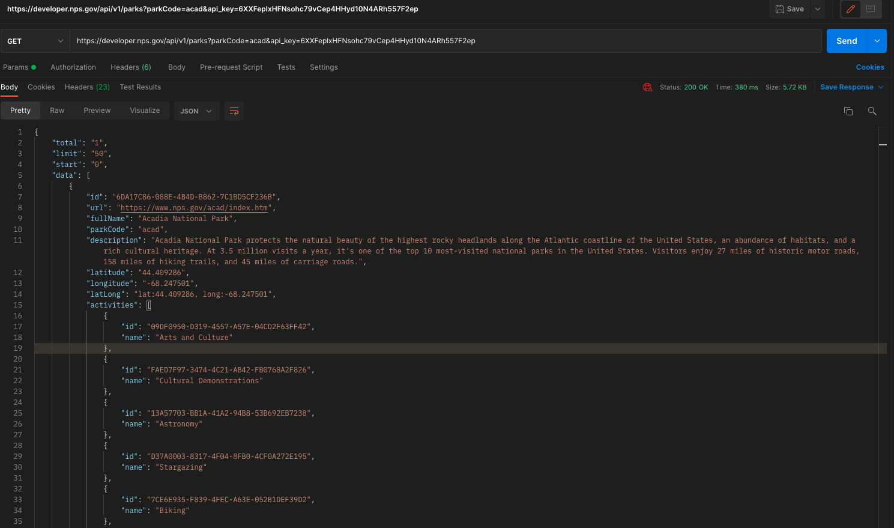

# App Title: Find-A-Park
Finds the closest national park to you

## App Description: 
A user enters their zip code and the app returns the closest national park to them.

## API: 
US National Parks Service: https://www.nps.gov/subjects/developer/api-documentation.htm#/

## Postman Snippet: 

## Wireframes: 
Wireframe: https://whimsical.com/find-a-park-N4oUtNMiKhevmnEFcG1gzC

## MVP: 
	1. The park name
	2. A photo of the park 
	3. A description of the park
	4. A list of activities to do in the park
	5. Weather info 
	6. Link to the National Parks website for more information

## Post-MVP:
	1. Create a slideshow of park images instead of just displaying a single image
	2. Display the expected weather conditions based on the current time of year
	3. Show a map from the user's location to the national park
	4. Display the 5 closest parks in order of closest to farthest

## Website Link:
Hosted through GitHub Pages: https://alexnwarton.github.io/find-a-park/

